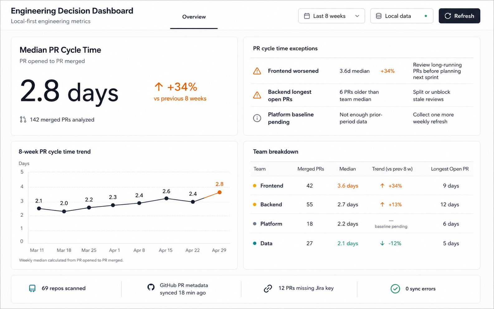

# Data Driven Decision Dashboard Documentation

This directory contains the product brief, roadmap, phase plan, setup guides, and mockups for the Data Driven Decision Dashboard.

## Start Here

- [Feature brief](Backlog/data-driven-decision-dashboard-brief.md)
- [Roadmap](Roadmap/data-driven-decision-dashboard-roadmap.md)
- [Trackable roadmap checklist](Roadmap/trackable-roadmap.md)
- [Current Phase 02 mockup](Assets/mockups/04-pr-cycle-time-and-first-review.png)

## For users (running the product locally)

The app is a **local** web application. After [installing Node.js](https://nodejs.org/) (20 or newer), from the **repository root** (one level above this folder):

1. Install dependencies: `npm install`
2. Copy `.env.example` to `.env`, set **`DATABASE_URL`**, and follow [Local onboarding](Setup/local-onboarding.md) for Postgres and optional GitHub sync.
3. Start the UI: `npm run dev`
4. Open **http://localhost:3000** in a browser.

The home route renders the **PR Cycle Time** dashboard (median, exceptions, 8-week trend, team breakdown, freshness, refresh). Run `npm run verify:phase01` before release-style checks (lint, typecheck, build, coverage, Playwright).

## For developers

- **[Developer guide](Development/README.md)** — stack, `npm` scripts, tests, and where code lives.
- **[Local onboarding](Setup/local-onboarding.md)** — Postgres, env vars, team mapping, and first real sync checklist.
- **[Scripts and CLI commands](Setup/scripts.md)** — `dev-up` / `dev-down`, migrations, `collector:refresh`, and `db:import-github`.
- **[GitHub token setup](Setup/github-token.md)** — authenticated GitHub API access.

Implementation work and task-level tests are tracked in **[FEAT-001 — PR Cycle Time MVP](Roadmap/phases/FEAT-001-pr-cycle-time-mvp-implementation-plan.md)** (task list and test names).

## Current MVP

The first release shows one metric only: PR Cycle Time.

## Next Step

Phase 02 (First Review Time) is implemented (see [FEAT-002-first-review-time-implementation-plan.md](Roadmap/phases/FEAT-002-first-review-time-implementation-plan.md)). Next step: [Phase 03: PR Size](Roadmap/phases/phase-03-pr-size.md).

Current Phase 02 UI reference:

Completed phase: [Phase 01: PR Cycle Time MVP](Roadmap/phases/phase-01-pr-cycle-time-mvp.md).

Detailed implementation plan: [FEAT-001 — PR Cycle Time MVP](Roadmap/phases/FEAT-001-pr-cycle-time-mvp-implementation-plan.md).

Track progress in [Trackable roadmap checklist](Roadmap/trackable-roadmap.md).
