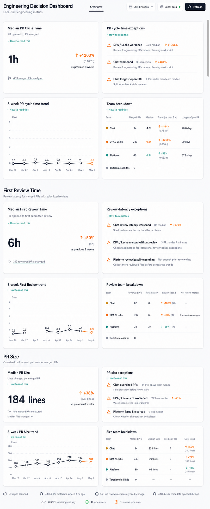

# Data Driven Decision Dashboard Documentation

This directory contains the product brief, roadmap, phase plan, setup guides, and mockups for the Data Driven Decision Dashboard.

## Start Here

- [Feature brief](Backlog/data-driven-decision-dashboard-brief.md)
- [Roadmap](Roadmap/data-driven-decision-dashboard-roadmap.md)
- [Trackable roadmap checklist](Roadmap/trackable-roadmap.md)
- [Current one-page mockup](Assets/mockups/05-pr-cycle-time-first-review-and-pr-size.png)

## For users (running the product locally)

The app is a **local** web application. After [installing Node.js](https://nodejs.org/) (20.19 or newer, or 22.12 or newer), from the **repository root** (one level above this folder):

1. Install dependencies: `npm install`
2. Copy `.env.example` to `.env`, set **`DATABASE_URL`**, and follow [Local onboarding](Setup/local-onboarding.md) for Postgres and optional GitHub sync.
3. Start the UI: `npm run dev`
4. Open **http://localhost:3000** in a browser.

The home route renders a **one-page scrolling metric dashboard**. PR Cycle Time stays first, First Review Time is second, and PR Size is third. Each later metric is appended below the previous metric section once its data is collected and computed. Use the current phase or stabilization verify command before release-style checks.

## For developers

- **[Developer guide](Development/README.md)** — stack, `npm` scripts, tests, and where code lives.
- **[Local onboarding](Setup/local-onboarding.md)** — Postgres, env vars, team mapping, and first real sync checklist.
- **[Scripts and CLI commands](Setup/scripts.md)** — `dev-up` / `dev-down`, migrations, `collector:refresh`, and `db:import-github`.
- **[GitHub token setup](Setup/github-token.md)** — authenticated GitHub API access.
- **[Architecture Decision Records](ADR/)** — durable records of significant design decisions and why alternatives were rejected.

Implementation work and task-level tests are tracked in the completed phase plans: **[FEAT-001 — PR Cycle Time MVP](Completed/FEAT-001-pr-cycle-time-mvp-implementation-plan.md)**, **[FEAT-002 — First Review Time](Completed/FEAT-002-first-review-time-implementation-plan.md)**, **[FEAT-003 — PR Size](Completed/FEAT-003-pr-size-implementation-plan.md)**, and the completed dashboard stabilization fixes.

## Current MVP

The current local dashboard shows three implemented GitHub-backed metrics: PR Cycle Time, First Review Time, and PR Size. The one-metric PR Cycle Time release is preserved as the Phase 01 historical baseline.

## Next Step

Phase 03 (PR Size) is implemented, including the PR Size trend confidence update (FIX-002): completed-week trend values are shown separately from current-week-so-far and low-sample confidence notes (see [FEAT-003-pr-size-implementation-plan.md](Completed/FEAT-003-pr-size-implementation-plan.md)).

The explicitly scheduled [FIX-004 dashboard stabilization gate](Completed/FIX-004-remaining-dashboard-16-week-trend-expansion.md) is complete, guided by its [authoritative brief](Completed/remaining-dashboard-16-week-trend-expansion-brief.md). FIX-005 is the scheduled pre-Phase-04 refinement: [Stale Open PR Exceptions](Backlog/FIX-005-stale-open-pr-exceptions.md), guided by its [brief](Backlog/stale-open-pr-exceptions-brief.md). Phase 04 remains the next feature phase: [Phase 04: Jira Flow Metrics](Backlog/phase-04-jira-flow-metrics.md).

Current one-page UI reference:

Completed phases:

- [Phase 01: PR Cycle Time MVP](Completed/phase-01-pr-cycle-time-mvp.md) — [FEAT-001](Completed/FEAT-001-pr-cycle-time-mvp-implementation-plan.md)
- [Phase 02: First Review Time](Completed/phase-02-first-review-time.md) — [FEAT-002](Completed/FEAT-002-first-review-time-implementation-plan.md)
- [Phase 03: PR Size](Completed/phase-03-pr-size.md) — [FEAT-003](Completed/FEAT-003-pr-size-implementation-plan.md)

Track progress in [Trackable roadmap checklist](Roadmap/trackable-roadmap.md).
