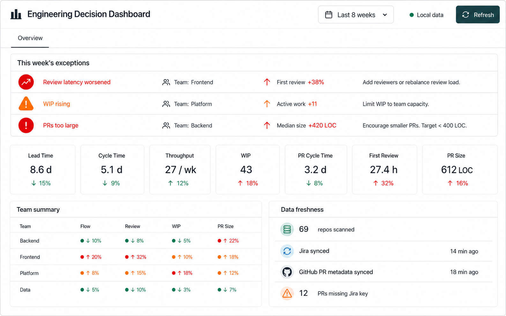
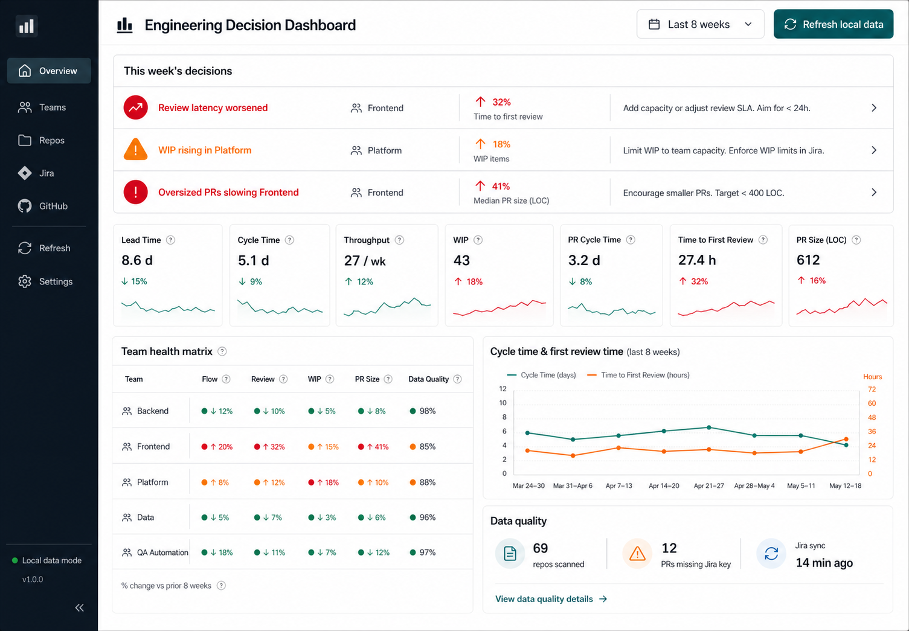

# Phase 00: Product Refinement And UI

Status: Draft
Last updated: 2026-05-15

## Goal

Lock the product direction, save the design history, and make the first release scope unambiguous before implementation starts.

## Decisions

- The app is a local-first web dashboard.
- The user is the Head of Engineering.
- The dashboard is for weekly decision-making, not passive reporting.
- The first release shows only PR Cycle Time.
- Future metrics are added only after their data exists.
- AI is skipped for v1.

## Mockups

### Current MVP

### Phase 02 Reference

### Superseded Concepts

This version is superseded because it shows too many metrics before their data collection exists.

This version is superseded because it includes broader navigation, quality views, and decision areas beyond the MVP.

## Acceptance Criteria

- Product brief exists.
- Roadmap exists.
- Phase docs exist.
- Mockups are stored inside the project.
- Phase 01 can be implemented without re-deciding the MVP scope.
