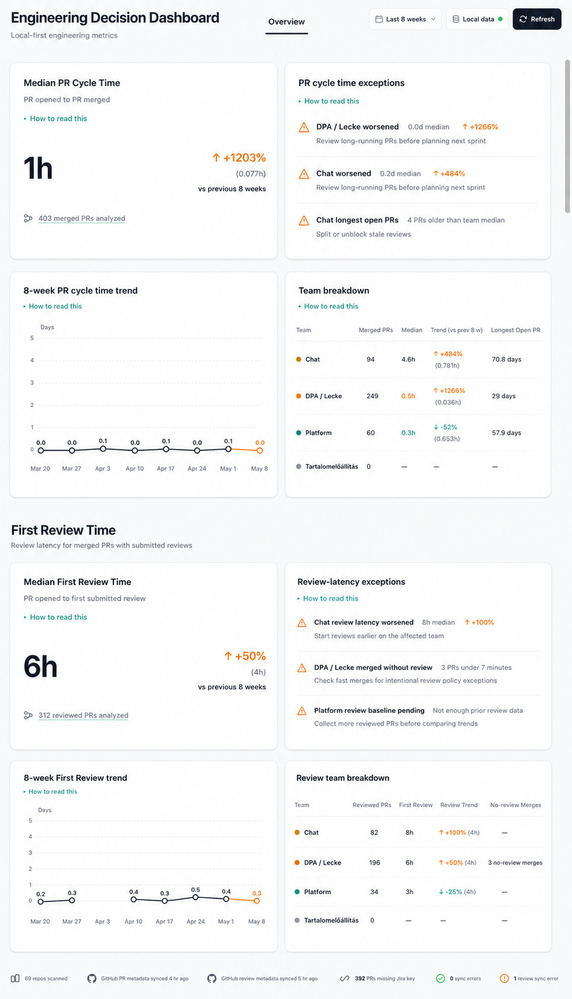

# Phase 02: First Review Time

Status: Draft (spec locked for implementation)
Last updated: 2026-05-15

Implementation plan: [FEAT-002 — First Review Time](FEAT-002-first-review-time-implementation-plan.md) (follows the structure of [FEAT-001 — PR Cycle Time MVP](FEAT-001-pr-cycle-time-mvp-implementation-plan.md)).

Depends on: [Phase 01: PR Cycle Time MVP](phase-01-pr-cycle-time-mvp.md) complete (`npm run verify:phase01`).

UI reference: [PR Cycle Time and First Review](../../Assets/mockups/04-pr-cycle-time-and-first-review.png).

## Goal

Add review-latency visibility after PR Cycle Time is working.

**First Review Time** is elapsed time from **PR opened** (`openedAt`) to **first submitted review** (`firstReviewSubmittedAt`), in hours, for merged pull requests only.

This phase adds a second computed metric and related UI. It does not change Phase 01 PR Cycle Time calculations or card behavior.

## Metric definition (locked)

These defaults mirror Phase 01 conventions unless noted.

| Rule | Definition |
|------|------------|
| Population | Merged PRs in the selected range (`mergedAt` within range, same as Phase 01). |
| Clock start | `openedAt` (include draft PRs; same as Phase 01). |
| Clock end | `firstReviewSubmittedAt` — timestamp of the earliest qualifying review on that PR. |
| Qualifying review | A GitHub **pull request review** with `state` in `APPROVED`, `CHANGES_REQUESTED`, or `COMMENTED` and a non-null `submitted_at`. |
| Excluded review states | `PENDING` and `DISMISSED` never count as the first review. |
| Author self-review | A review submitted by the PR author **does** count (same as real GitHub activity; no author filtering). |
| Bot reviews | Bot-submitted reviews **do** count (parity with Phase 01 bot inclusion). |
| Review after merge | Reviews with `submitted_at` **after** `mergedAt` are ignored for first-review time and participation counts. |
| No qualifying review | PR is **excluded from First Review median, trend, and team medians** but included in the **merge-without-review hygiene** signal below. |
| Aggregate | **Median** hours of First Review Time over the qualifying population (not mean). |
| Previous period | Same 8-week immediately preceding window as Phase 01; trend/baseline rules below. |
| Range label | Fixed **Last 8 weeks** until range selection is a separate roadmap item. |

**Not in scope for the First Review median:** issue comments, review-thread replies without a submitted review, or “review requested” events with no submitted review.

## Merge-without-review hygiene (separate signal)

Distinct from the First Review median — do not fold into median math.

Flag merged PRs in range where **all** of the following hold:

- `distinctReviewAuthors === 0` (no qualifying reviews from any user), and
- `reviewCommentCount === 0` (diff review comments with `created_at < mergedAt` — see schema), and
- `mergedAt - openedAt` is less than **7 minutes** (same threshold called out in the Phase 01 “how to read” copy).

Surface as a **review-latency exception** and as a team-level **No-review Merges** count, not as a team median input. Any PR-level detail view must show PR title and repo only — **no author names** (leadership hygiene, not surveillance).

## UI Changes

- Add a **First Review Time** section below the Phase 01 dashboard content so users scroll down from the PR Cycle Time view into the review-latency view.
- Add a **Median First Review Time** metric card at the top of that section.
- Subtitle: `PR opened to first submitted review`.
- Show `No merged PRs with a review in range` when every merged PR in range lacks a qualifying review (not `0 minutes`).
- Show `Baseline pending` when previous-period comparison is unavailable (same rules as Phase 01).
- Add a separate **Review-latency exceptions** panel so Phase 01's PR Cycle Time exception slots remain unchanged.
- Add a separate **Review team breakdown** table with **Reviewed PRs**, **First Review**, **Review Trend**, and **No-review Merges** columns.
  - **First Review** shows median hours; `—` when the team has no qualifying PRs.
  - **Review Trend** shows First Review trend versus the previous 8 weeks; `—` when comparison is unavailable.
  - **No-review Merges** shows the team-level merge-without-review hygiene count; `—` when none match.
- Add **8-week First Review weekly trend** chart (always renders; empty weeks show `null`, same as Phase 01). Show **trend percentage** on the card only when at least **3** qualifying PRs exist in the previous period and previous median `> 0`.
- Extend data freshness: last review sync time and review sync errors (per-repo partial failure allowed).
- **Do not** add placeholder cards for Phase 03+ metrics.

Phase 01 PR Cycle Time card, exceptions, trend, team breakdown, and copy remain unchanged in the first viewport.

## Mockup alignment

The Phase 02 UI should match [04-pr-cycle-time-and-first-review.png](../../Assets/mockups/04-pr-cycle-time-and-first-review.png):

- Keep the Phase 01 header, range label, Local data pill, Refresh action, PR Cycle Time card, PR Cycle Time exceptions, PR Cycle Time trend, and Phase 01 team breakdown as the first viewport.
- Place the **First Review Time** section below the Phase 01 grid with enough spacing that the dashboard reads as scrollable, not cramped.
- In the First Review section, place **Median First Review Time** beside **Review-latency exceptions**.
- Place **8-week First Review trend** beside **Review team breakdown**.
- Keep review-specific team metrics out of the Phase 01 team table.
- Include footer freshness items for both GitHub PR metadata and GitHub review metadata, plus separate review sync errors.

## Data and schema

### GitHub sync (REST, same stack as Phase 01)

Two endpoints per merged PR (budget accordingly):

1. `GET /repos/{owner}/{repo}/pulls/{pull_number}/reviews` (paginated) — `firstReviewSubmittedAt`, `distinctReviewAuthors`.
2. `GET /repos/{owner}/{repo}/pulls/{pull_number}/comments` (paginated) — `reviewCommentCount` (hygiene rule only; still fetched in the same review-sync step).

- Run the review sync step **after** PR lifecycle sync for each repository.
- **Concurrency:** one **global** semaphore capped at `GITHUB_SYNC_CONCURRENCY` for all review and comment fetches across repos (do not multiply concurrency per repo × per repo).
- **Recompute rule:** on each PR sync, recompute `firstReviewSubmittedAt`, `distinctReviewAuthors`, and `reviewCommentCount` from the full API responses (no incremental deltas — handles dismissed reviews and state changes).
- **Incremental strategy:** store `lastReviewSyncedAt` on `repositories` (set to sync **finish** time when the repo’s review sync succeeds). On refresh, re-fetch reviews for merged PRs where `githubUpdatedAt > repo.lastReviewSyncedAt` **or** review fields were never populated (`firstReviewSubmittedAt IS NULL` and `distinctReviewAuthors = 0` and `reviewCommentCount = 0` after first migration). When `lastReviewSyncedAt IS NULL`, full backfill all merged PRs in the repo.
- **Partial failure:** per-repo errors go to `sync_errors` with `source: github_reviews`; do not update `lastReviewSyncedAt` for that repo. Per-PR failures within a repo log an error but do not block other PRs; only update `lastReviewSyncedAt` when the repo pass completes.
- **Rate limits:** if GitHub returns rate-limit errors, stop starting new review fetches, record the error, and leave `lastReviewSyncedAt` unchanged for affected repos.

### Storage (PostgreSQL / Drizzle migration)

New columns on `pull_requests` (preferred over a separate events table for Phase 02):

- `firstReviewSubmittedAt` (nullable timestamp with time zone)
- `distinctReviewAuthors` (integer, default 0) — authors of qualifying reviews before merge
- `reviewCommentCount` (integer, default 0) — count of diff review comments where `created_at < mergedAt` (post-merge comments excluded; same rule as line 31)

Optional on `repositories`:

- `lastReviewSyncedAt` (nullable timestamp with time zone)

## Exception rules (locked)

Per-type gating (do not use one gate for all types):

| Type | Condition | Severity | Gating |
|------|-----------|----------|--------|
| `review_latency_worsened` | Current team median First Review Time is at least **25% higher** than previous period **and** previous baseline available (≥3 qualifying PRs in previous period, previous median `> 0`). | `warning` | Team has ≥1 qualifying First Review PR in the current period. |
| `merge_without_review` | At least one merged PR in range matches the hygiene rule above for that team. | `warning` | Team has ≥1 merged PR in range (qualifying reviews **not** required). |
| `review_baseline_pending` | Team has qualifying current-period PRs but fewer than 3 qualifying PRs in the previous period. | `info` | Team has ≥1 qualifying First Review PR in the current period. |

Sort using the same severity and tie-break rules as Phase 01 (`warning` before `info`, then by trend magnitude, then team name). **Cap at 3** Phase 02 exceptions (independent of the Phase 01 cap of 3). Default FEAT-002 choice: **separate** exceptions panel for review latency so Phase 01’s three slots are unchanged.

## Architecture notes

- Reuse the Phase 01 collector library and refresh entrypoint; add a review sync step after PR metadata sync.
- Extend computed metrics in a dedicated `first-review-time` module; **extend** the existing dashboard payload type with a nested `firstReview` object (keep Phase 01 fields flat and unchanged for regression safety).
- No Jira, auth, cloud, or PR Size work in this phase.

## Acceptance criteria checklist

- [ ] Drizzle migration adds review fields and applies cleanly.
- [ ] Collector syncs GitHub review metadata and stores `firstReviewSubmittedAt` and participation counts.
- [ ] First Review median, previous-period comparison, trend, team breakdown, and exceptions are computed per locked rules.
- [ ] Dashboard shows the First Review card only when review data has been synced at least once (empty computation states use explicit copy, not placeholders).
- [ ] Merge-without-review hygiene is visible without polluting the First Review median.
- [ ] PR Cycle Time metric, UI, and `npm run verify:phase01` behavior remain unchanged.
- [ ] `npm run verify:phase02` passes (lint, typecheck, build, coverage ≥85%, e2e including Phase 02 scenarios).

## Verification and tests (required in FEAT-002)

Phase 02 is not complete without explicit tests. FEAT-002 must name tests up front (TDD), including at minimum:

| Area | Required coverage |
|------|-------------------|
| Metric unit | `first_review_uses_earliest_submitted_review`; `dismissed_and_pending_ignored`; `review_after_merge_ignored`; `no_review_excluded_from_median`; `bot_and_author_reviews_count`; `merge_without_review_hygiene_rule`; `review_comment_count_excludes_post_merge` |
| Exceptions unit | `review_latency_worsened_emitted`; `merge_without_review_without_qualifying_reviews`; `review_baseline_pending_emitted`; `review_exceptions_capped_at_three` |
| Schema / migration | `migration_adds_review_columns`; `migration_applies_on_fresh_db` |
| Sync integration | `review_sync_persists_first_review_timestamp`; `review_sync_persists_participation_counts`; `review_sync_recomputes_on_dismissed_review`; `per_repo_review_sync_error_isolated`; `last_review_synced_at_on_success_only` |
| Dashboard component | `first_review_card_renders_median`; `no_review_in_range_copy`; `baseline_pending_on_first_review_card`; `first_review_weekly_trend_renders_null_weeks`; `first_review_team_column`; `review_exceptions_panel`; `phase01_cycle_time_unchanged`; `no_future_metric_cards` |
| Route / e2e | `dashboard_shows_first_review_after_sync`; `e2e_no_first_review_before_sync_fixture`; `e2e_merge_without_review_visible` |
| Regression | Re-run full Phase 01 test paths unchanged |
| Docs | `docs_phase_02_defines_metric_locks`; `docs_phase_02_links_feat_002_placeholder`; `docs_phase_02_exception_gating_documented` |

Each acceptance checklist item above must map to at least one named test in FEAT-002.

Add `verify:phase02` to `package.json` when implementation starts (mirror `verify:phase01`).

## Resolved FEAT-002 UI decisions

- None. The Phase 02 mockup, scroll-below-Phase-01 layout, and separate review-latency exceptions panel are now locked for FEAT-002.

## Acceptance Criteria (reference)

Product intent (tracked completion in checklist above):

- First Review Time appears only after review data is synced and computed.
- Exceptions identify teams with worsening review latency and merge-without-review hygiene.
- PR Cycle Time UI and metrics continue to work unchanged.
- No individual author ranking or shaming.
